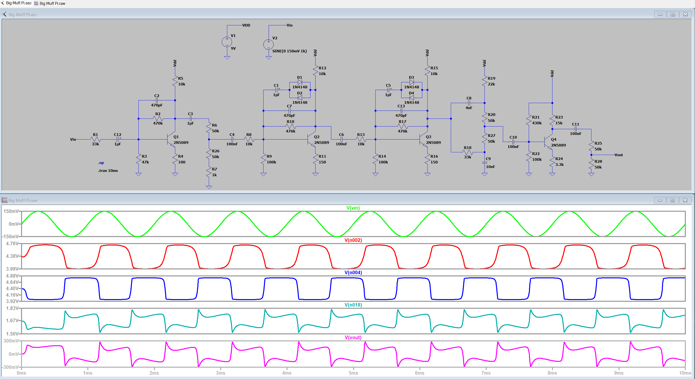
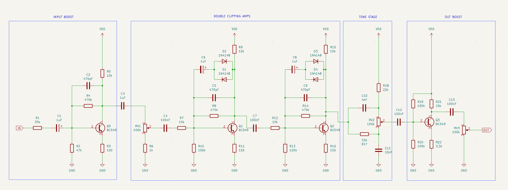

# Big Muff Pi Build

This project serves as an example guitar pedal build and some best practices for documentation / builds for UF AES Design

*(I also just really wanted a Big Muff)*

## Overview

List out how to go about this jawn

## Table of Contents
- [Simulation](#ltspice-simulation)
- [Bill of Materials](#bill-of-materials-bom)
- [Hardware](#hardware)
    - [Schematic](#schematic)

## Project Status

| Phase                 | Status     | 
| -----                 | --------   | 
| LTSpice Simulation    | ✅        | 
| Schematic             | ✅        | 
| Component Footprints  |            | 
| PCB                   |         | 

## LTSpice Simulation

## Bill of Materials (BOM)

fix this later lmao

| PART                      | QTY           | Part #            |
| -----                     | --------      | -----------       |
| BC549 NPN Transistor      | 4             | Q1, Q2, Q3, Q4    |
| 1N4148 Silicon Diodes     | 4             | D1, D2, D3, D4    |
| 100k Potentiometer        | 3             | RV1, RV2, RV3     |
| 470k Resistor             | 3             | R4, R8, R14       |  
| 100k Resistor             | 3             |                   |
| 47k Resistor              | 1             | R2                |
| 33k Resistor              | 2             | R1, R17     |
| 22k Resistor              | 1             |      |
| 15k Resistor              | 1             |      |
| 3.3k Resistor             | 1             |     |
| 1k Resistor               | 1             |      |
| 150 Resistor              | 2             |     |
| 100 Resistor              | 1             | R3     |

## Hardware 
### Schematic:

